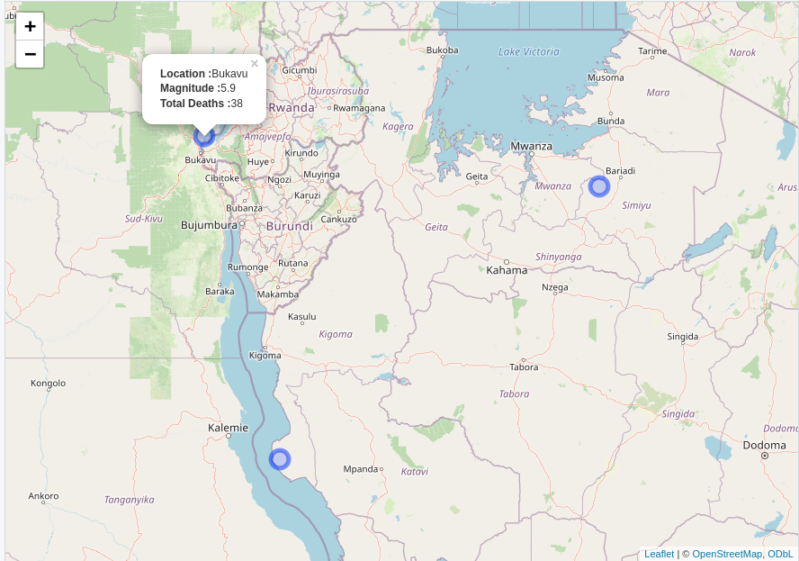

<!-- README.md is generated from README.Rmd. Please edit that file -->

```{r, include = FALSE}
knitr::opts_chunk$set(
  collapse = TRUE,
  comment = "#>",
  fig.path = "man/figures/README-",
  out.width = "100%"
)
```

# courseraquakes

<!-- badges: start -->

<!-- badges: end -->

courseraquakes is the capstone project for coursera specialisation "Mastering R software development". This package load, clean up, and visualize National Centers for Environmental Information (NCEI) earthquake data.

## Installation

You can install the development version of courseraquakes like so:

``` r
devtools::install_github("IBN0/courseraquakes")
```

## Data Cleaning

`initial_cleaning` gives you cleaned up date and location column. But it did not do further cleaning on other column, as the package does not interact with them.

```{r example}
library(courseraquakes)
clean_df <- initial_cleaning()
clean_df %>% select(Location, Date, Magnitude, `Total Deaths`) %>% head()
```

## Timeline Plot

For convenience, the package have wrapper function that filter the dataframe based on date and countries.

```{r timeline plot}
timeline_plot <- timeline(clean_df, y = Country, minyear = 2010, maxyear = 2012, countries = c('INDONESIA', 'INDIA'))
plot(timeline_plot)
```

If the label is turned on, then you can determine if you want to limit the amount of label shown based on n highest magnitude earthquake.

```{r timeline with label}
timeline_plot <- timeline(clean_df, y = Country, minyear = 1500, maxyear = 2015, countries = c('SYRIA', 'EGYPT'),
                          label = TRUE, nmax = 10)
plot(timeline_plot)
```

Notice how we define the `y` axis. If not defined, then all earthquake will coalescence into one line.

If you want to specify how you sort your data frame for label filtering/limiting, then you need to build your own ggplot2 data.

```{r custom timeline}
filtered_df  <- clean_df %>% datecountry_filter(minyear = 2001, maxyear = 2010, countries = c("VIETNAM", "PHILIPPINES"))
finalplot <- ggplot() +
    geom_timeline(
      data = filtered_df,
      mapping = aes(
        x    = Date,
        y    = Country,
        size = Magnitude,
        col  = `Total Deaths`
      ),
      alpha = 0.8
    ) +
    labs(x = "DATE")                                     +
    scale_size_continuous (name = "Richter scale value") +
    scale_color_continuous(name = "# deaths") +
    theme_classic() + 
    geom_timeline_label(
      data = filtered_df,
      mapping = aes(
        x = Date,
        y = Country,
        label = Location,
        Magnitude = `Total Deaths`
      ),
      nmax = 10
    )
plot(finalplot)
```

Keep in mind, if the column you select for label or magnitude have missing value, the geom will not report any warning.

## Interactive Map

The package also have wrapper for leaflet function. This will return interactive map. Just like `timeline` function, this function first filter the dataframe into filter function first

```{r interactive map}
map <- eq_map(df = clean_df, annotation = 'popup_text', minyear = 2001, maxyear = 2015, countries = c('CONGO', 'TANZANIA'))
```

The resulting image will look like this 

Credit:

While I write most of the code by myself, I adapted geomtimeline function from <https://github.com/RussellPolitzky/quake/tree/master>
