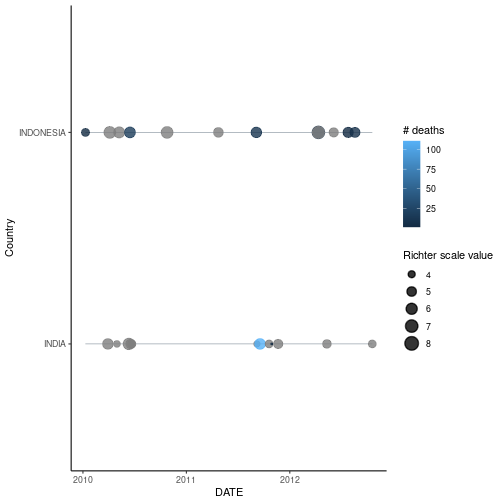

<!-- README.md is generated from README.Rmd. Please edit that file -->


# courseraquakes

<!-- badges: start -->

[](https://github.com/IBN0/courseraquakes/actions/workflows/R-CMD-check.yaml)
[](https://github.com/IBN0/courseraquakes/actions/workflows/test-coverage.yaml)
<!-- badges: end -->

courseraquakes is the capstone project for coursera specialisation "Mastering R software development". This package load, clean up, and visualize National Centers for Environmental Information (NCEI) earthquake data.

## Installation

You can install the development version of courseraquakes like so:

``` r
devtools::install_github("IBN0/courseraquakes")
```

## Usage
Use `initial_cleaning` to load and clean the data, then use `timeline` and `eq_map` to filter
and show plot or interactive map.


```r
library(courseraquakes)
clean_df <- initial_cleaning()
timeline_plot <- timeline(clean_df, y = Country, minyear = 2010, maxyear = 2012, countries = c('INDONESIA', 'INDIA'))
plot(timeline_plot)
```

<div class="figure">

<p class="caption">plot of chunk usage</p>
</div>

### Credit:

While I write most of the code by myself, I adapted geomtimeline function from <https://github.com/RussellPolitzky/quake/tree/master>
